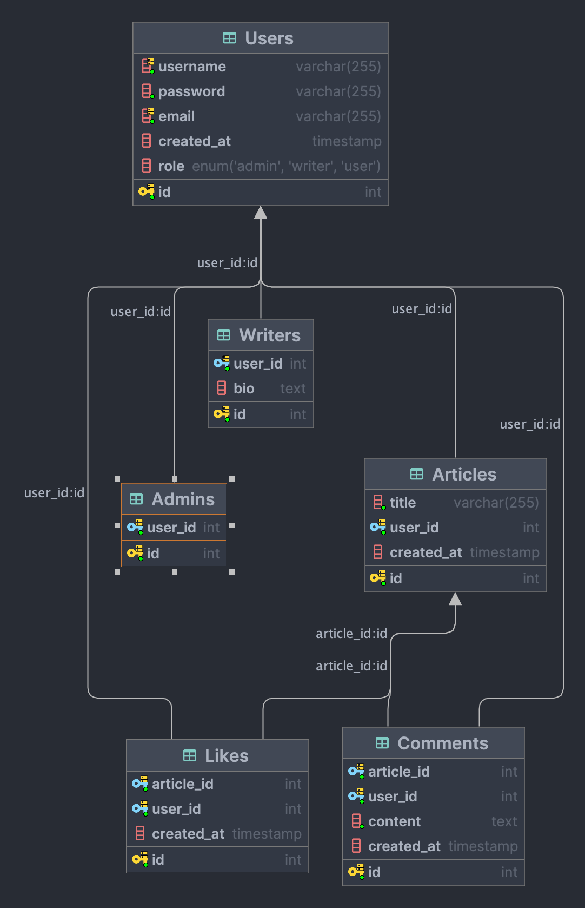

# Junior Developer Resources

## Project Overview

"**Junior Developer Resources**" is a platform where users can either learn about various subjects by reading articles or share their knowledge by writing articles. The platform aims to connect individuals with expertise in specific areas, allowing them to share their experiences with others. Originally developed as a final project for a Full-Stack Web Development course, this system also serves as a personal project where I can share my learnings on different technical subjects.

## Technologies Used

### Frontend

This frontend is built using React, with a focus on creating a responsive and user-friendly interface. The platform allows users to read articles, comment on them, and like them. Users can also create an account, log in, and write their own articles.

- **React**: For building the user interface.
- **React Router**: For managing navigation between pages.
- **Marked**: To convert Markdown files to HTML.
- **Vite**: For the build system.
- **Axios**: For making API calls.
- **Context Provider**: For managing authentication and sending messages to users.

### Backend

This backend is using Node.js, Express.js, and MongoDB. It is a RESTful API that allows users to create, read, update,
and delete posts. The posts are stored in a MongoDB database.

- **Express.js**: For creating the server and handling routes.
- **MySQL**: As the primary relational database.
- **MongoDB**: As the secondary NoSQL database.
- **JWT (JSON Web Token)**: For authentication and token management.
- **bcrypt**: For hashing passwords.
- **Pug**: As the view engine (though primarily for error pages).

## Project Structure

### Frontend

- **Pages and Components**: Organized using `react-router` and `Outlet` for structured navigation. Common components include `Navbar`, `Main`, and `Footer`.
- **API Folder**: Contains files for each API route, along with wrapper methods for authenticated requests.
- **Authentication**: Handled with an expiring token stored in `localStorage`, using a Context Provider.

### Backend

- **Routes**: Each route is separated into its own folder.
- **Databases**: Organized into MySQL and MongoDB folders, with separate connections.
- **Models**: Each model and entity has its own file in the Models folder.
- **Middleware**: Custom middleware for handling authentication, admin, and writer permissions, ensuring certain requests are protected based on the user's role.

#### Routes

- **Auth** - Handles user registration and login.
  - `POST /auth/login`
  - `POST /auth/register`
  - `GET /auth/me`
- **Articles** - CRUD operations for articles.
  - `GET /articles/:id`
  - `GET /articles`
  - `POST /articles`
  - `PUT /articles/:id`
  - `GET /articles/user/:id`
  - `DELETE /articles/:id`
- **Comments** - CRUD operations for comments.
  - `POST api/comments`
  - `DELETE api/comments/:id`
  - `PUT api/comments/`
  - `GET api/comments/:article_id`
  - `GET api/comments/user/:user_id`
- **Likes** - CRUD operations for likes.
  - `POST api/likes`
  - `DELETE api/likes`
  - `GET api/likes/article/:article_id`
  - `GET api/likes/user/:user_id`
  - `GET api/likes/liked`
- **Users** - CRUD operations for users.
  - `DELETE /users/:id`
  - `PUT /users/:id`
  - `GET /users/:id`
  - `GET /users/username/:username`
- **Admin** - CRUD operations for admin users.
  - `GET /admin/is-admin`
  - `GET /admin/users`
  - `GET /admin/users/:id`
  - `POST /admin/users/:id`

#### Middleware

- **Auth Middleware**: Verifies the token and sets the user's role.
- **Admin Middleware**: Checks if the user is an admin.
- **Writer Middleware**: Checks if the user is a writer.

Example usage:

```javascript
// authMiddleware.js
const authMiddleware = async (req, res, next) => {
  // get the token from the header
  const token = req.header("x-auth-token");

  if (!token) {
    return res.status(401).json({ message: "Access Denied" });
  }

  // verify the token
  try {
    const verified = jwt.verify(token, process.env.TOKEN_SECRET);
    // verified is the payload of the token and is an object containing the username and email
    [req.user] = await userModel.getUserByUsername(verified.username);
    next();
  } catch (err) {
    res.status(400).json({ message: "Invalid token" });
  }
};

// likes.js
router.post("/", auth, async (req, res) => {
  const article_id = req.body.article_id;
  const user_id = req.user.id;

  if (!article_id) {
    return res.status(400).send("Please provide article_id");
  }

  try {
    // check if the user has already liked the article
    const hasLiked = await likeModel.hasLiked(article_id, user_id);
    if (hasLiked) {
      return res.status(400).send("You have already liked this article");
    }
    const result = await likeModel.createLike(article_id, user_id);
    return res.status(201).json(result);
  } catch (error) {
    console.log(error);
    return res.status(500).send("Server error");
  }
});
```

#### MySQL Schema



```sql
CREATE TABLE Users
(
    id         INT AUTO_INCREMENT PRIMARY KEY,
    username   VARCHAR(255) NOT NULL,
    password   VARCHAR(255) NOT NULL,
    email      VARCHAR(255) NOT NULL,
    created_at TIMESTAMP                        DEFAULT CURRENT_TIMESTAMP,
    role       ENUM ('admin', 'writer', 'user') DEFAULT 'user',
    UNIQUE (username),
    UNIQUE (email)
);

CREATE TABLE Writers
(
    id      INT AUTO_INCREMENT PRIMARY KEY,
    user_id INT NOT NULL,
    bio     TEXT,
    FOREIGN KEY (user_id) REFERENCES Users (id) ON DELETE CASCADE
);

CREATE TABLE Admins
(
    id      INT AUTO_INCREMENT PRIMARY KEY,
    user_id INT NOT NULL,
    FOREIGN KEY (user_id) REFERENCES Users (id) ON DELETE CASCADE
);

-- the content will be stored in a MongoDB database
CREATE TABLE Articles
(
    id         INT AUTO_INCREMENT PRIMARY KEY,
    title      VARCHAR(255) NOT NULL,
    user_id    INT          NOT NULL,
    created_at TIMESTAMP DEFAULT CURRENT_TIMESTAMP,
    FOREIGN KEY (user_id) REFERENCES Users (id)
);

CREATE TABLE Comments
(
    id         INT AUTO_INCREMENT PRIMARY KEY,
    article_id INT  NOT NULL,
    user_id    INT  NOT NULL,
    content    TEXT NOT NULL,
    created_at TIMESTAMP DEFAULT CURRENT_TIMESTAMP,
    FOREIGN KEY (article_id) REFERENCES Articles (id) ON DELETE CASCADE,
    FOREIGN KEY (user_id) REFERENCES Users (id) ON DELETE CASCADE
);

CREATE TABLE Likes
(
    id         INT AUTO_INCREMENT PRIMARY KEY,
    article_id INT NOT NULL,
    user_id    INT NOT NULL,
    created_at TIMESTAMP DEFAULT CURRENT_TIMESTAMP,
    FOREIGN KEY (article_id) REFERENCES Articles (id) ON DELETE CASCADE,
    FOREIGN KEY (user_id) REFERENCES Users (id) ON DELETE CASCADE
);
```

#### MongoDB Schema

```javascript
const mongoose = require("mongoose");

const articleSchema = new mongoose.Schema({
  title: {
    type: String,
    required: true,
  },
  author: {
    type: Number,
    required: true,
  },
  content: {
    type: String,
    required: true,
  },
  createdDate: {
    type: Date,
    default: Date.now,
  },
  lastUpdated: {
    type: Date,
    default: Date.now,
  },
  tags: {
    type: [String],
  },
  articleId: {
    type: Number,
    required: true,
  },
});
```

## Learning and Challenges

This project was my first experience building an API with Express.js, MongoDB, and MySQL. I learned about authentication, tokens, and middleware for the backend. On the frontend, I explored new features in React, such as Context Provider, advanced usage of React Router, and the concept of private routes.

## Setup and Installation

To set up the project locally:

1. Clone the repository.
2. Run `npm install` in both the frontend and backend directories.
3. Start the frontend and backend servers using `npm start`.

## Features

The platform is designed to cater to different user roles:

- **Public**: Pages accessible without logging in, such as viewing articles. However, commenting and liking are restricted.
- **User**: Access to additional features like the user profile, after logging in.
- **Writer**: Privileges to write, edit, and delete their own articles.
- **Admin**: Can manage users on the platform, including granting additional privileges.
